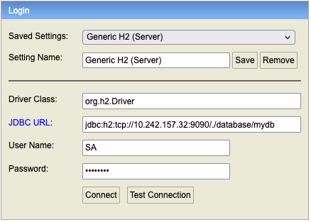
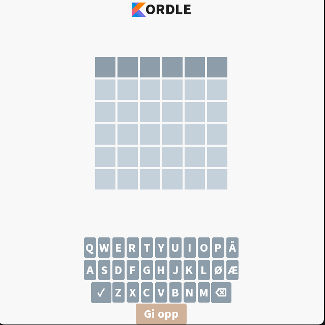

# Oppgave 1: Hent en tilfeldig oppgave

For at vår appliaksjon skal fungere, må vi kunne hente ut et ord som brukeren kan gjette på.
I denne workshoppen har vi opprettet en database med ord som en kan gjette på i Kordle. Disse ordene er lagret i
databasetabellen `oppgave`.
Disse ordene kan sees ved å

1. Kjøre opp backend-applikasjonen.
2. Gå inn på http://localhost:8080/h2-console i nettleseren din. Dette vil åpne opp H2-konsollen.
3. Logge inn med følgende innstillinger:
    - Saved Settings: `Generic H2 (Server)`
    - JDBC URL: `jdbc:h2:tcp://10.242.157.32:9090/./database/mydb`
    - User Name : `SA` (All caps)
    - Password: `PASSWORD` (All caps)

Instillingene skal se slik ut:



Deretter trykker du på `Connect`-knappen.

4. Når du er inne i H2-konsollen, vil se en liste over tabeller i databasen. Trykk på pluss-tegnet ved siden av
   `Oppgave` for å se de forskjellige kolonnene i tabellen.

5. Her vil en se at `oppgave`-tabellen består av følgende kolonner:
    - `id` - ID-en til oppgaven
    - `ord` - Ordet som skal gjettes på
    - `lengde` - Lengden på ordet

6. I midten av skjermen vil du se en `Query Console` der du kan skrive SQL-spørringer for å hente ut data fra databasen.
   Når spørringen er skrevet, kan du trykke på
   `Run`-knappen for å kjøre spørringen. Resultatet av spørringen vil vises i tabellen under `Query Console`.

## Oppgave 1.1: Hent ut alle oppgaver fra databasen

I denne oppgaven skal vi hente ut alle oppgavene fra databasen ved hjelp av en SQL-spørring. Hvis du vil lese mer om
sql-spørringer, kan du gjøre dette [her](https://www.w3schools.com/sql/sql)

Oppgaver:

1. Skriv en SQL-spørring som henter ut alle oppgaver fra tabellen `oppgave` i databasen.
   Du kan gjerne teste spørringen i `Query Console` først.
2. Legg inn spørringen i funksjonen `hentAlleOppgaver`i `OppgaveRepository`-klassen som
   finnes [her](../server/src/main/kotlin/no/bekk/kordle/server/repository/OppgaveRepository.kt)

<details>
<summary> Løsningsforslag </summary>

Oppgave 1:

```sql
SELECT *
FROM OPPGAVE
```

Oppgave 2:

```kotlin
fun hentAlleOppgaver(): List<Oppgave> {
    return jdbcTemplate.query(
        """
        SELECT * FROM OPPGAVE
        """.trimIndent(),
        DataClassRowMapper(Oppgave::class.java),
    )
}
```

</details>

## Oppgave 1.2: Spring-annotasjoner og Forretningslogikk

Spring bruker annotasjoner for å definere hvordan det spring kaller <i>komponenter</i> skal oppføre seg. Slike
komponenter
er vanligvis klasser som er annotert med f.eks. `@Service`, `@Repository` eller `@Controller`.
Et eksempel på dette kan sees i `OppgaveRepository.kt`, hvor vi har annotert klassen med `@Repository` for å fortelle
spring at dette er
en <i>komponent</i> som skal brukes til å hente ut data fra en datakilde, i dette tilfellet en database.

Det kule med dette er at spring automatisk vil opprette en instans av denne klassen og gjøre den tilgjengelig for
andre komponenter som trenger den. Dette kalles <i>Dependency Injection</i> og er en viktig del av hvordan spring
fungerer. I praksis betyr dette at vi kan bruke `OppgaveRepository` i andre komponenter uten å måtte opprette en instans
av den
selv og en kan heller la Spring håndtere dette for oss.

I praksis betyr dette at vi kan bruke `OppgaveRepository` slik:

```kotlin
@Service
class EnAnnenService(
    private val oppgaveRepository: OppgaveRepository
) {
    fun brukOppgaveRepository() {
        ...
    }
}
```

Dette kan vi gjøre uten å måtte bry oss om hvordan `OppgaveRepository` er implementert eller hvordan den henter ut data
fra.
Alt vi trenger å gjøre er å kaste `OppgaveRepository` inn i konstruktøren til `EnAnnenService`, og Spring vil håndtere
resten for oss.

Hvis du vil lese mer om dependency injection i Spring, kan du gjøre
det [her](https://docs.spring.io/spring-framework/reference/core/beans/dependencies/factory-collaborators.html).

Oppgaver:

1. I `OppgaveService.kt` (ligger [her](../server/src/main/kotlin/no/bekk/kordle/server/service/OppgaveService.kt)), dra
   inn `OppgaveRepository` som en dependency ved å legge den til som et parameter i klassen
   `OppgaveService`
2. Lag en funksjon i `OppgaveService.kt` som henter ut alle oppgaver lagret i databasen og returnerer en tilfeldig
   oppgave. Returtypen til funksjonen skal være `Oppgave`, en klasse som
   ligger [her](../server/src/main/kotlin/no/bekk/kordle/server/domain/oppgave.kt).

<details>
<summary> Løsningsforslag </summary>

Oppgave 1:

Vi kan dra inn `OppgaveRepository` i `OppgaveService` ved å legge den til som et parameter i konstruktøren til
`OppgaveService`. Dette gjør at Spring kan opprette en instans av `OppgaveRepository` og injisere den inn i
`OppgaveService`.

```kotlin
@Service
class OppgaveService(
    val oppgaveRepository: OppgaveRepository
) {
    ...
}
```

Oppgave 2:

```kotlin
fun hentTilfeldigOppgave(): Oppgave {
    val alleOppgaver = oppgaveRepository.hentAlleOppgaver()
    val tilfeldigOppgave = alleOppgaver.random()
    return tilfeldigOppgave
}
```

</details>

## Oppgave 1.3: Api-endepunkter

I denne oppgaven skal vi åpne opp et endepunkt for å bruke vår nye funksjonalitet, evnen til å hente ut en tilfeldig
oppgave.
Dette vil la frontenden vår hente ut en tilfeldig oppgave fra serveren og vise den til brukeren. For å kunne gjøre
dette, må vi lage et REST-endepunkt.
På lik linje med hvordan vi brukte annotasjonen `@Service` for å fortelle Spring at `OppgaveService` er en tjeneste,
bruker vi
annotasjonen `@RestController` for å fortelle Spring at en klasse er en kontroller som håndterer HTTP-forespørsler med
REST.
I vår applikasjon har vi allerede opprettet en kontroller for oppgaver, `OppgaveController.kt`, som
ligger [her](../server/src/main/kotlin/no/bekk/kordle/server/controller/OppgaveController.kt).

For å kunne opprette et REST-endepunkt, må vi bruke først lage en funksjon i kontrolleren som kan håndtere
forespørselen.
Deretter må vi bruke annotasjonen `@GetMapping` for å fortelle Spring at denne funksjonen skal håndtere GET-forespørsler
samt definere URL-en for endepunktet.
Hvis ønskelig kan en lese mer om `@GetMapping` eller Requestmapping generelt i
spring [her](https://docs.spring.io/spring-framework/reference/web/webmvc/mvc-controller/ann-requestmapping.html)

Oppgaver:

1. Lag en ny funksjon i `OppgaveController.kt` som henter ut en tilfeldig oppgave og returnerer en instans av typen
   `Oppgave`.
2. Omgjør denne funksjonen til et GET-endepunkt ved å bruke annotasjonen `@GetMapping`. Endepunktet skal ha URLen
   `/hentTilfeldigOppgave`"

Når du føler deg klar for å teste endepunktet, kan du kjøre opp backenden (hvis den ikke allerede er oppe) og deretter
bruke
følgende kommando i terminalen for å hente ut en tilfeldig oppgave:

```bash
curl -X GET http://localhost:8080/hentTilfeldigOppgave -s -w "\nHTTP Status: %{http_code}\n"
```

<details>
<summary> Løsningsforslag </summary>

Oppgave 1:

```kotlin
fun hentTilfeldigOppgave(): Oppgave {
    return oppgaveService.hentTilfeldigOppgave()
}
```

Oppgave 2:

```kotlin
@GetMapping("/hentTilfeldigOppgave")
fun hentTilfeldigOppgave(): Oppgave {
    return oppgaveService.hentTilfeldigOppgave()
}
```

</details>

## Oppgave 1.4: Data Transfer Objects (DTOer)

En utfordring med å lage REST-endepunkter er at vi må være forsiktige med hva vi utlever til klienten
da vi ikke nødvendigvis ønsker at klienten skal ha tilgang til all informasjon som finnes i backend-applikasjonen.
Dette er spesielt viktig når det kommer til sensitiv informasjon.

Som vist ovenfor når en kjører `curl`-kommandoen, vil en se at endepunktet returnerer `Oppgave`-objektet i JSON-format,
inkludert feltet `ord`, som er ordet som skal gjettes på.

Dette er litt uheldig, da det betyr at klienten får tilgang til ordet som skal gjettes på.
Videre betyr dette også at dersom vi har behov for å endre på `Oppgave`-objektet i backend-applikasjonen,
påvirker dette også dataen som sendes til klienten.

Begge disse problemene kan løses ved å bruke Data Transfer Objects (DTOer). DTO-er er enkle klasser som kun inneholder
data og skjermer
både vår interne foretningslogikk samt sørger for at endringer i vår foretningslogikk ikke påvirker hvordan klienten
mottar dataen.

Vi har laget en DTO `OppgaveResponse` (finnes [her](../shared/src/main/kotlin/no/bekk/kordle/shared/dto/oppgave.kt)) som
ikke inneholder denne dataen.

Oppgaver:

1. Bytt ut returtypen til funksjonen i `OppgaveController.kt` fra `Oppgave` til `OppgaveResponse`.

<details>
<summary> Løsningsforslag </summary>

Oppgave 1:

```kotlin
@GetMapping("/hentTilfeldigOppgave")
fun hentTilfeldigOppgave(): OppgaveResponse {
    return oppgaveService.hentTilfeldigOppgave().tilOppgaveResponse()
}
```

</details>


🧪 Når du er ferdig, kan du kjøre opp frontend-applikasjonen og teste om endepunktet fungerer ved å åpne opp
applikasjonen. Hvis det ser slik ut:



er alt tipp topp! 🎉
