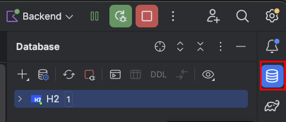

# Opprett HTTP-endepunkter

1. Hent en tilfeldig oppgave
I denne workshoppen har vi opprettet en database med ord som en kan gjette på i Kordle. Disse ordene er lagret i datbase-tabellen `oppgave`.
Disse ordene kan sees ved å
   1. Kjøre opp backend-applikasjonen.
   2. Trykke på `database`-fanen helt til høyre i Intellij. 
   
   

   3. Trykke på `H2` -> `MYDB` -> `PUBLIC` -> `tables` -> `OPPGAVE` 
   4. Her vil en se at tabellen består av følgende kolonner:
      - `id` - ID-en til oppgaven
      - `ord` - Ordet som skal gjettes på
      - `lengde` - Lengden på ordet
   
For denne oppgaven skal vi lage et API som returnerer en tilfeldig oppgave i databasen via et HTTP GET-kall. Les mer om GET her: https://developer.mozilla.org/en-US/docs/Web/HTTP/Methods/GET
Spesifikasjoner for oppgaven:
1. Endepunktet skal ligge i `OppgaveController` og være et GET-kall til urlen `/hentTilfeldigOppgave`
2. `OppgaveService` skal bruke `oppgaveRepository.hentAlleOppgaver()` for å hente ut alle oppgaver fra databasen og returnere en tilfeldig oppgave fra disse oppgavene.

Gjerne ta inspirasjon fra `hentAlleOppgaver`-funksjonaliteten i `OppgaveController.kt` og `OppgaveService.kt` til å løse problemet

🧪 Når du er ferdig, kjør kommandoen
```bash
curl -X GET http://localhost:8080/hentTilfeldigOppgave | jq . 
```
Hvis du får en respons som ser ut som dette
```json
{
  "oppgaveId": 214,
  "lengde": 6
}
```
så er du ferdig med oppgaven! 🎉
